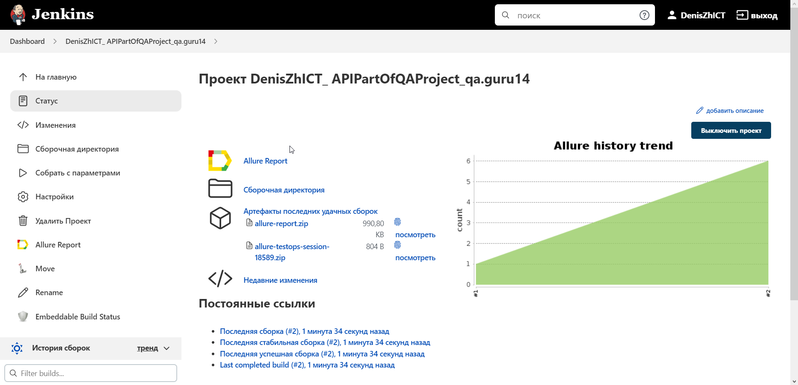
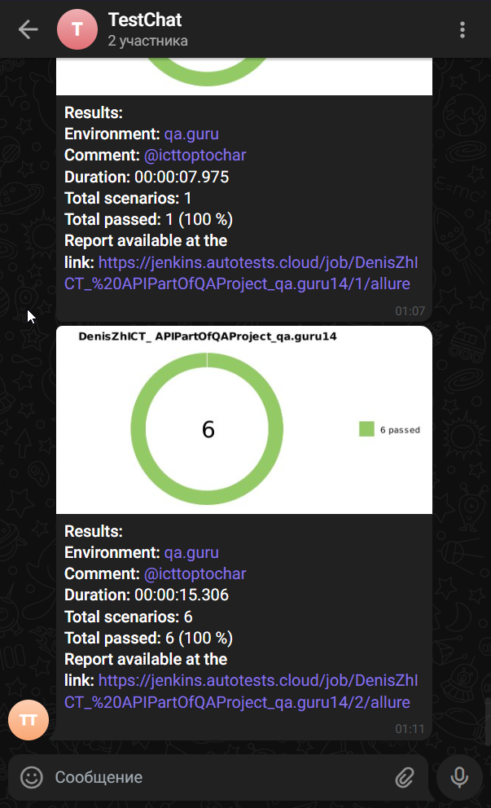

# <a target="_blank" href="https://github.com/DenZhICT/APIPartOfQAProject">Проект: API Автоматизации тестирования Reqres</a>

## :scroll: Содержание:

- [Технологии и инструменты](#hammer_and_wrench-технологии-и-инструменты)
- [Реализованные проверки](#memo-реализованные-проверки)
- [Сборка в Jenkins](#man_technologist-jenkins-job)
- [Запуск из терминала](#desktop_computer-Запуск-тестов-из-терминала)
- [Allure отчет](#chart_with_upwards_trend-отчет-в-allure-report)
- [Отчёт в Allure TestOps](#bar_chart-отчет-в-allure-testops)
- [Отчет в Telegram](#grapes-уведомление-в-telegram-при-помощи-бота)

## :hammer_and_wrench: Технологии и инструменты

<p align="center">
<a href="https://www.jetbrains.com/idea/"></a>
<a href="https://www.java.com/"></a>
<a href="https://github.com/"></a>
<a href="https://junit.org/junit5/"></a>
<a href="https://gradle.org/"></a>
<a href="https://rest-assured.io"></a>
<a href="https://github.com/allure-framework/allure2"></a>
<a href="https://qameta.io"></a>
<a href="https://www.jenkins.io/"></a>
<a href="https://telegram.org"></a>
</p>

## :memo: Реализованные проверки

- :white_check_mark: Проверка фамилии пользователя по id.
- :white_check_mark: Проверка о 404 ошибке.
- :white_check_mark: Проверка создания нового пользователя.
- :white_check_mark: Проверка удаления пользователя.
- :white_check_mark: Проверка регистрации.
- :white_check_mark: Проверка существования пантон-цвета.

## :man_technologist: Jenkins job

<a target="_blank" href="https://jenkins.autotests.cloud/job/DenisZhICT_%20UIPartOfQAProject_qa.guru14/">Сборка в Jenkins</a>
<p align="center">

</p>

### Параметры сборки в Jenkins:

* test_type (Определят тип запускаемых тестов по Tag'ам)

### :desktop_computer: Запуск тестов из терминала

```bash
gradle clean All
```

### :globe_with_meridians: Удаленный запуск:

```bash
clean 
${TEST_TYPE}
```

## :chart_with_upwards_trend: Отчет в <a target="_blank" href="https://jenkins.autotests.cloud/job/DenisZhICT_%20UIPartOfQAProject_qa.guru14/9/allure/">Allure report</a>

### Основное окно

<p align="center">

</p>

## :bar_chart: Отчет в <a target="_blank" href="https://allure.autotests.cloud/launch/16977/tree?treeId=0">Allure TestOps</a>

### Test Result Tree

<p align="center">

</p>

## :grapes: Уведомление в Telegram при помощи бота

<p align="center">

</p>